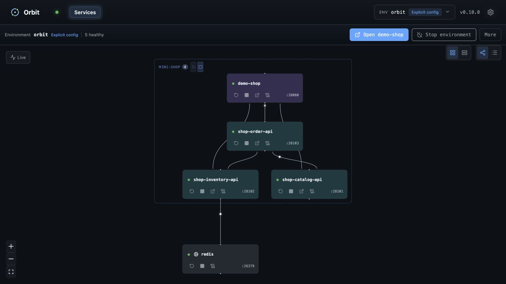

#  Orbit

把專案需要的所有服務——host processes 與 containers——放進同一個可觀測的
本機環境。

[官方網站](https://iml885203.github.io/orbit/) · [試玩 demo](#試玩-orbit) ·
[在你的專案使用 Orbit](docs/local-first.zh-TW.md) ·
[安裝](docs/development.zh-TW.md) · [文件](#文件) ·
[English](https://iml885203.github.io/orbit/)



Orbit 把一份 `orbit.yaml` 變成可重現的 stack，供本機開發、CI 與 coding agents
共同使用。

- **一起啟動：** containers 與 host processes 會依 dependency 順序啟動。
- **知道什麼真的 ready：** dashboard 與 CLI 集中顯示 health、logs、ports、
  traces 與失敗原因。
- **到哪裡都跑同一套：** developers、test suites 與 agents 共用一份有版本的
  environment definition。

## 試玩 Orbit

Demo 需要 Git、Docker、Python 3，以及
[已安裝的 Orbit CLI](docs/development.zh-TW.md)：

```bash
git clone https://github.com/iml885203/orbit-demo.git
cd orbit-demo
orbit up
orbit status
orbit open demo-shop
```

[Orbit demo](https://github.com/iml885203/orbit-demo) 是一個迷你 storefront：
三個 host APIs、放在 Redis container 裡的即時庫存，以及存進 SQLite 的訂單。
買一個馬克杯就能看到 request 穿過整張 graph；完成後用 `orbit down` 停止環境。

## 一份檔案描述整個環境

在你的程式碼旁存一份 `orbit.yaml`
（[可直接執行的範例](https://github.com/iml885203/orbit/tree/main/docs/examples/local-first)）：

```yaml
version: "3"

containers:
  redis:
    image: redis:7.4-alpine
    ports:
      redis: "26379:6379"

services:
  app:
    kind: frontend
    command: python3 -m http.server "$PORT"
    ports:
      http: 28080
    depends_on: [redis]
```

日常迴圈只有四個指令：

```bash
orbit up       # 依 dependency 順序啟動所有資源
orbit status   # 查看實際 ready 的狀態
orbit logs app # 檢查 application output
orbit down     # 停止環境
```

Orbit 會先啟動 Redis 再啟動 host process、等待真實 readiness 而不是把
「process 存在」當成「可以使用」、把宣告的 port 注入為 `PORT`。Default
runtime 的 port 固定不移動：衝突時會報錯並指出占用的程式與 remedy。編輯
`orbit.yaml` 後再執行一次 `orbit up`：Orbit 會先驗證新設定，再中斷任何東西。

平行 checkout 或 CI job 請使用 named instance。它會隔離 daemon state、Docker
resources、volumes、networks 與 host ports，同時維持 default runtime 的相容性：

```bash
orbit up --instance checkout-a
orbit status --instance checkout-a --json
orbit instance list --json
orbit instance clean checkout-a
```

Named instance 會把宣告的 host ports 視為 preferences、持久化解析結果，並透過
`up`、`status` 與 `instance list` 回報實際 endpoints；caller 不必自行協調底層
environment variables。完整語意見
[隔離的 runtime instances](docs/instances.zh-TW.md)。

[在你的專案使用 Orbit](docs/local-first.zh-TW.md) 完整走過這條路徑，並說明
如何把驗證過的檔案升級為團隊共享 environment。所有欄位請見
[設定](docs/configuration.zh-TW.md)。

## 安裝

macOS 或 Linux 使用 Homebrew：

```bash
brew install iml885203/tap/orbit
```

Windows 使用 Scoop（Beta）：

```powershell
scoop bucket add iml885203 https://github.com/iml885203/scoop-bucket
scoop install orbit
```

macOS 與 Linux 也可以使用直接安裝並驗證過的 release：

```bash
curl -fsSL https://raw.githubusercontent.com/iml885203/orbit/main/scripts/install.sh | bash
export PATH="$HOME/.local/bin:$PATH"
```

Windows PowerShell（Beta）：

```powershell
irm https://raw.githubusercontent.com/iml885203/orbit/main/scripts/install.ps1 | iex
```

這會安裝最新發布的 preview release。Orbit 只安裝自己的 CLI，不會安裝專案的
runtimes 或 dependencies；`orbit doctor` 會回報所選 environment 需要什麼與
明確的修復方式。升級、rollback、移除與平台細節請見
[安裝與開發](docs/development.zh-TW.md)。

## 搭配 AI agent

Agent 透過同一套 CLI 加上 `--json` 讀取狀態；錯誤帶有穩定 code 與可直接
執行的建議動作：

```bash
orbit status --json
orbit doctor --json
orbit env info --json   # 給住在 stack 旁邊的東西:port、URL、以引用表示的憑證
```

Repository 內含 `plugins/orbit-agent`，是版本對齊的 Claude 與 Codex
plugin，其 skill 會要求 agent 先檢查狀態、優先使用 `--json`，並在破壞性
操作前確認。在 Claude Code 中：

```bash
claude plugin marketplace add iml885203/orbit
claude plugin install orbit-agent@orbit
```

不安裝 plugin 時，讓 agent 直接閱讀
[skill](https://github.com/iml885203/orbit/blob/main/plugins/orbit-agent/skills/orbit/SKILL.md) 與
[JSON contract](docs/agent-cli.zh-TW.md)。

## Dashboard

`orbit open` 會開啟本機 dashboard：dependency graph 與 service controls、
environment 預覽與切換、logs、health diagnostics、traces 與 request
playback。Dashboard 只綁定 loopback。

## 文件

核心使用者文件：

- [在你的專案使用 Orbit](docs/local-first.zh-TW.md)
- [為什麼是 Orbit](docs/why-orbit.zh-TW.md) —— 設計取捨與工具比較
- [設定](docs/configuration.zh-TW.md)
- [Environment sources](docs/environment-sources.zh-TW.md)
- [隔離的 runtime instances](docs/instances.zh-TW.md)
- [在 E2E 測試底下使用 Orbit](docs/e2e-testing.zh-TW.md)
- [Tracing](docs/tracing.zh-TW.md)
- [疑難排解](docs/troubleshooting.zh-TW.md)
- [版本與相容性](docs/versioning.zh-TW.md)

選用 workflows（environment 啟用後才生效）：

- [SQL Server Database Projects](docs/sql-workflow.zh-TW.md)
- [Tunnel claims](docs/tunnel-claim.zh-TW.md)

導入者與 contributors：

- [團隊導入](docs/team-adoption.zh-TW.md)
- [架構](docs/architecture.zh-TW.md)
- [開發](docs/development.zh-TW.md)
- [Agent CLI contract](docs/agent-cli.zh-TW.md)
- [Contributing](CONTRIBUTING.md)

## License

[MIT](https://github.com/iml885203/orbit/blob/main/LICENSE)。Binary 內嵌第三方
dependencies，licenses 與 attributions 列於
[NOTICE](https://github.com/iml885203/orbit/blob/main/NOTICE)。
