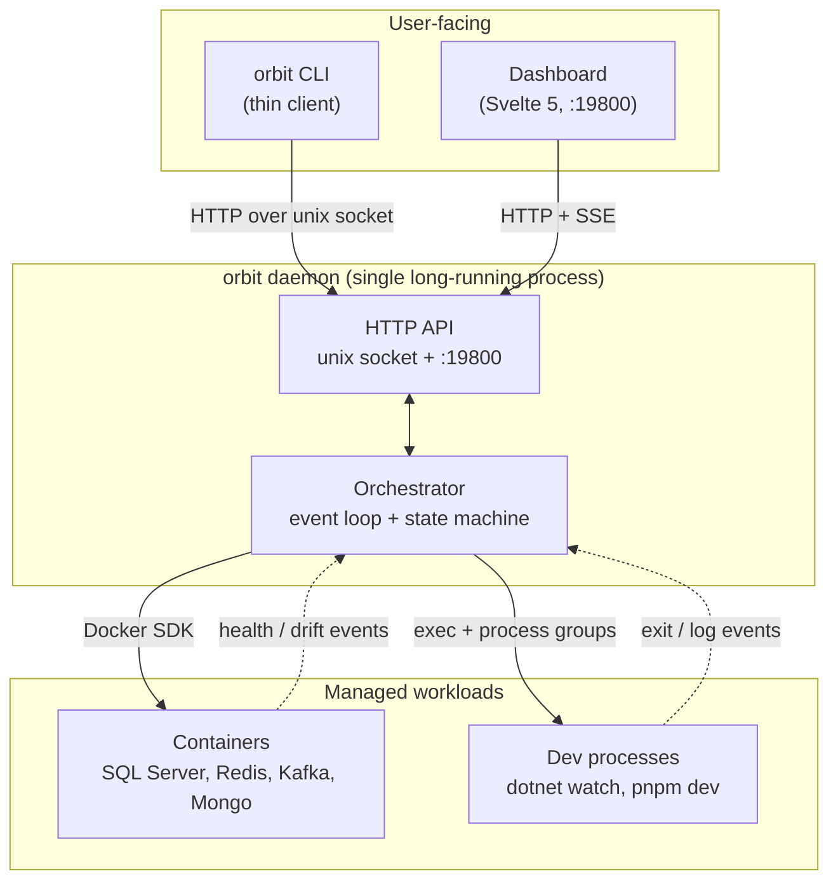
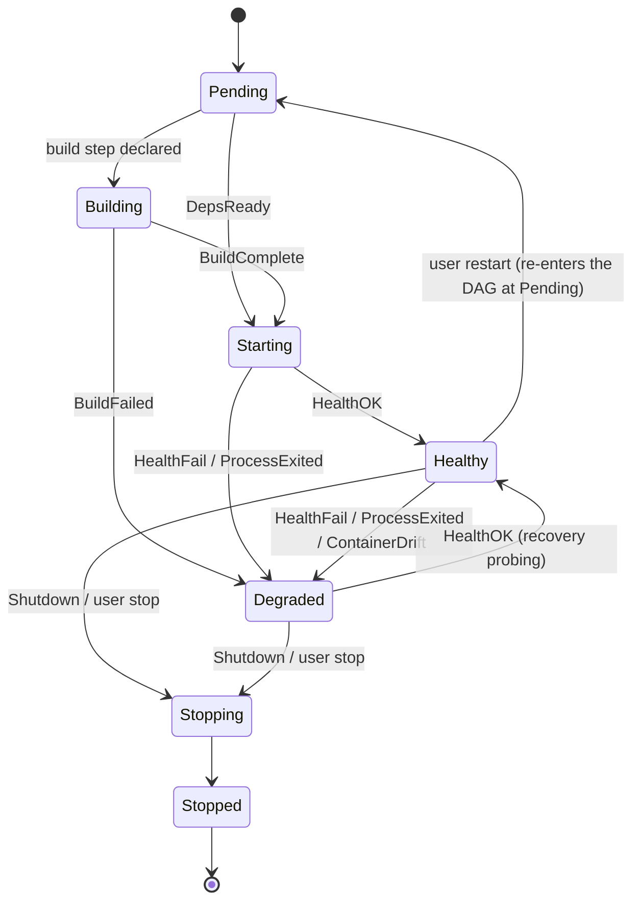

# Architecture

[English](./architecture.md) · [繁體中文](./architecture.zh-TW.md)

This document explains how Orbit's internals fit together so you can extend, debug, or audit it without re-reading the whole codebase.

## Overview



Three things to hold in your head:

1. **The daemon is the brain.** It owns all state. The CLI is stateless — it opens the socket, makes one request, prints, exits. The dashboard is the same API over TCP plus SSE streams.
2. **The orchestrator is event-driven.** A single goroutine consumes events (`HealthOK`, `ProcessExited`, `ContainerDrift`, …) and applies state transitions synchronously. Containers and dev processes share the same state machine — only the supervision mechanics differ.
3. **Dependencies are a DAG, not a sequence.** Services start as soon as their `depends_on` targets reach `Healthy`; independent branches run in parallel.

The rest of this doc drills into each piece.

## Component map

```
orbit up
  │
  ├─ Config Loader      config/                 YAML → typed schema, env-var substitution, validation
  ├─ Dependency DAG     internal/engine/        Topological sort over services + containers
  ├─ Orchestrator       internal/engine/        Event loop: translates events into state transitions
  ├─ Scheduler          internal/engine/        Decides what to start / stop / restart next
  ├─ Container Manager  container/              Docker SDK wrapper (inspect, start, stop, poll, seed, init)
  ├─ Process Manager    process/                Spawn / kill dev processes with group isolation
  ├─ Health Checker     internal/health/        http, tcp, log, exec, healthcheck probes + wait strategies
  ├─ Port / Preflight   port/, internal/preflight/  Reserve ports, check prerequisites before launch
  ├─ Env Sync           internal/envsync/       Shallow-clone / refresh env configs from git
  └─ Daemon Server      internal/daemon/        Unix socket + TCP :19800 API, Svelte 5 dashboard, SSE
```

The CLI (the `app` package, wired by each binary's thin `cmd/orbit/main.go`) is a thin client over the daemon — every subcommand either talks to the daemon over its unix socket or runs local subprocesses (docker, dotnet).

## Service state machine

Every service and container goes through the same states. Transitions are driven by orchestrator events.



State constants live in `internal/engine/state.go` as `ServiceState` (iota enum: `StatePending`, `StateBuilding`, `StateStarting`, `StateHealthy`, `StateDegraded`, `StateStopping`, `StateStopped`, `StateRestarting`). Use the constants — raw strings only appear in JSON output. (`StateRestarting` remains defined for wire/String compatibility, but the current lifecycle routes a restart straight back to `Pending` rather than dwelling in it — see the state diagram above.)

## Event loop

The orchestrator runs a single goroutine that consumes events from a buffered channel. Events are defined in `internal/engine/state.go`:

| Event | Emitted when | Typical reaction |
|---|---|---|
| `DepsReady` | All declared `depends_on` targets reached `Healthy` | Start this service |
| `HealthOK` | Probe succeeded after previous non-OK state | Mark `Healthy`; notify dependents |
| `HealthFail` | Probe failed or timed out | Mark `Degraded`; may trigger restart |
| `ProcessExited` | Child dev process exited | Mark `Degraded` (unexpected) or `Stopped` (expected) |
| `ContainerDrift` | Docker poll says container state differs from Orbit's view | Reconcile: mark `Degraded` or re-sync |
| `BuildStarted` / `BuildComplete` / `BuildFailed` | Service build step (e.g. `dotnet build`) lifecycle | Move through `Building` → `Starting` |
| `Shutdown` | `orbit down` or signal | Cascade `Stopping` to all services in reverse DAG order |

(`EventServiceLog` carries a captured stdout/stderr line. It is dispatched through the same loop but triggers no state transition — it is broadcast to log subscribers (SSE, `orbit logs`), which is why it is absent from the transition table above.)

Events never mutate state directly — they are dispatched to the orchestrator which applies transitions synchronously. This keeps the state machine single-threaded and makes reasoning about races tractable.

## Startup sequence

```mermaid
sequenceDiagram
    participant CLI as orbit up
    participant D as Daemon
    participant Cfg as Config Loader
    participant DAG as Dependency DAG
    participant Orch as Orchestrator
    participant Svc as Service
    participant HC as Health Checker

    CLI->>D: ensure daemon running
    CLI->>D: POST /api/up
    D->>Cfg: Load(configPath)
    Cfg-->>D: typed schema
    D->>DAG: build(services, containers)
    DAG-->>D: topological order
    D->>Orch: run(order) — dispatch, non-blocking
    D-->>CLI: 200 OK (affected resources + dispatch result) — returns immediately
    Note over Orch,HC: convergence continues async; CLI/dashboard observe via SSE / orbit status
    Orch->>Svc: start (no deps)
    Svc-->>Orch: started
    Orch->>HC: probe()
    HC-->>Orch: HealthOK
    Orch->>Svc: start (deps now ready)
    Svc-->>Orch: started
    Orch->>HC: probe()
    HC-->>Orch: HealthOK
```

`POST /api/up` returns as soon as startup is *dispatched* (`handlers_service.go` calls `StartServices` then responds), not after everything is healthy — the CLI/dashboard watch convergence over the SSE status stream. Services are launched as soon as their declared dependencies reach `Healthy`. The DAG itself doesn't block — independent services start in parallel.

The response identifies the exact daemon-resolved resource set, including
transitive dependencies and group filtering. The CLI waits only for that set.
When the set is empty, `up` is an explicit successful no-op and returns
immediately instead of entering a health timeout.

## Container supervision vs process supervision

| | Container | Process |
|---|---|---|
| Owner | `container/manager.go` | `process/manager.go` |
| Start | Docker `container.create` + `container.start` | `exec.Command` under a fresh process group (`setpgid` on Unix, Job Objects on Windows) |
| Stop | Docker stop + 10s grace → kill | SIGTERM to the group → `shutdown_timeout` grace (default 30s) → SIGKILL to the group |
| Health | Polled every 2s via `container.inspect` plus the service's declared `health_check` | The declared `health_check` only |
| Drift detection | Successful Docker snapshots reconcile stopped, removed, or externally restarted containers | Implicit: if the process dies, `ProcessExited` fires |

Both kinds share the same state machine and event loop. The differences are entirely inside `manager.go` of each package.

Two consecutive Docker API failures invalidate previously healthy container
claims without turning a brief transport hiccup into user-visible churn.
`status` identifies Docker as the root cause and leads to `orbit doctor`.
Orbit keeps polling and restores resource truth automatically when Docker
returns; restarting Orbit or each container is not part of the recovery model.

## Cross-platform process groups

Killing a dev process (e.g. `dotnet watch`) with SIGTERM often leaves grandchild processes running. Orbit solves this by putting every spawned process in its own process group and signalling the **group**, not the leader.

- **Unix** (`platform/process_unix.go` on Linux/macOS): `syscall.SysProcAttr{Setpgid: true}`, then `syscall.Kill(-pgid, sig)` on shutdown.
- **Windows**: Job Objects. The spawned process is attached to a job, and closing the job handle terminates every descendant atomically.

Result: `orbit down` reliably reaps the whole process tree — shell, `dotnet watch` reloading, or `pnpm dev` Vite instance — rather than signalling only the leader and leaving grandchildren behind.

Lifecycle cancellation and an explicit stop share one process-group
termination. A restart waits until that exact process generation has exited
and its manager record is removed before a replacement can be tracked. Late
exit or health events from the replaced generation are ignored.

Process PID/PGID ownership is persisted immediately after registration, before
health can be reported. After an abrupt daemon exit, Orbit safely retires a
live persisted process before normal startup creates a fresh child; adopting it
would retain output pipes connected to the dead daemon and could report a false
recovery. A dead persisted PID becomes an ordinary stopped service. Containers
carry namespace, service, and config-fingerprint labels, so a new daemon can
adopt an exact running match or safely replace a stale owned container.
External port-conflict reporting is reserved for resources Orbit cannot prove
it owns.

## Health check types

`internal/health/checker.go` implements five probe types:

| Type | Use case | Cadence |
|---|---|---|
| `http` | HTTP endpoint returns 2xx | Polled every `health_check_interval` |
| `tcp` | TCP port accepts connection | Polled |
| `exec` | Run a command inside the container; exit 0 = healthy | Polled |
| `log` | Regex match against container logs | Triggered by log tail |
| `healthcheck` | Defer to Docker's own `HEALTHCHECK` result | Polled via inspect |

Probes run in a per-service goroutine with a context cancelled at stop — see `internal/health/checker.go` and the tests under `internal/health/` (e.g. `checker_test.go`, `recover_test.go`) for the contract.

After startup, every repeatable probe (`http`, `tcp`, `exec`, and Docker
`healthcheck`) keeps running. A configurable consecutive-failure threshold
prevents one transient miss from flapping the graph; one successful probe
recovers a degraded resource. `log` remains a one-shot readiness signal
because a past log match has no meaningful inverse probe.

Status assembly overlays dependency availability without rewriting lifecycle
state. If a healthy process depends on a stopped or degraded resource, API
views report it as degraded with `blocked_by`; direct dependencies form an
inspectable chain. Restoring the root dependency makes the overlay disappear,
so still-running dependents recover without a restart.

## Daemon server

`internal/daemon/server.go` is the single long-running process. It exposes:

- **Unix socket** (`~/.orbit/orbit.sock`) — CLI ↔ daemon HTTP (REST `/api/...`) over the unix socket
- **Loopback TCP :19800** — same HTTP API plus the Svelte 5 dashboard
  (embedded via `go:embed`) and SSE streams. Loopback Host validation and
  same-origin mutation checks protect the browser-facing control surface.

All HTTP handlers live in `internal/daemon/*.go` by concern:

| File | Concern |
|---|---|
| `server.go` | Router, middleware |
| `handlers_service.go` | up/down/stop/restart/logs |
| `handlers_service_env.go` | Per-service env var overrides |
| `handlers_mode.go` | Per-service dev ↔ container mode switching |
| `handlers_logging.go` | SSE log tail |
| `handlers_env_toggles.go` | Per-env feature toggles |
| `handlers_events.go` | SSE status event stream |
| `handlers_traces.go` | Trace list / detail ([tracing.md](tracing.md)) |
| `handlers_graph.go` | Dependency DAG queries |
| `handlers_history.go` | Past run history |
| `handlers_settings.go` | User settings (workspace root) |
| `resource_snapshot.go` | `GET /api/resources` — uniform, read-only resource snapshots |
| `envs.go` / `envs_dir.go` | Env list / current |
| `doctor.go` | Health diagnostics |

The daemon owns all shared state. CLI commands are stateless — they open the socket, make one request, print, exit.

### Resource snapshot contract

`GET /api/resources` exposes containers, services, externals, databases,
tunnels, and claimed routes in one display-oriented shape:
`{schema_version, env, resources}`. Each resource has `name`, open-vocabulary
`type` and `state`, optional `parent` and `depends_on`, and flat string
`properties`.

The contract is additive: `schema_version` changes only for removals or
renames. Consumers must render unknown resource types, states, fields, and
properties generically. `parent` represents ownership; `depends_on` represents
the startup graph. Ordering is deterministic with parents before children.

The snapshot does not replace purpose-built APIs. Streams, graph presentation,
actions, and cross-machine tunnel claims remain in their domain endpoints.

## Extension points

Common changes and where they land. Optional features wire commands, daemon
routes, and dashboard panels through the `extension` package; the points below
cover changes to the core itself.

### Add a new service `type`
1. Extend the `Service.Type` discriminator in `config/schema.go`.
2. Add a launcher in `internal/engine/scheduler.go` that knows how to start that type.
3. If health-checking differs, add a probe type in `internal/health/checker.go`.
4. Update `envs/example.yaml` with a reference entry.

### Add a new health check type
1. Add a case in `internal/health/checker.go` (`checker.probe()`).
2. Document the YAML shape in `docs/configuration.md`.

### Add a new init hook
Current types: `kafka_topics`, `mongo_rs`. To add one:
1. Add a case in `container/init.go`.
2. Define the config struct in `config/schema.go` under the container's `init` block.

### Add a new CLI subcommand
1. New file under `app/` returning a `*cobra.Command` from a `fooCmd()` factory.
2. Register it in `Main()` in `app/root.go`.
3. If it talks to the daemon, add a handler in `internal/daemon/*.go` and call it from the command: a `daemon.Client` method if the payload is wire-typed (public `daemon` package), or an unexported helper next to the command built on `Client.GetDecode`/`PostJSON` if the payload names core-internal types (see `app/traces.go`, `app/history.go`).

### Ship a new asset alongside the binary
Embed via `//go:embed` rather than relying on an on-disk path — the installed binary has no source tree. See `cmd/orbit/dashboard.go` for the dashboard bundle (embedded in the binary's main package and injected into the daemon server; a branded binary embeds its own dashboard build the same way).

## See also

- [docs/configuration.md](configuration.md) — full YAML schema reference
- [docs/tracing.md](tracing.md) — local OpenTelemetry workflow
