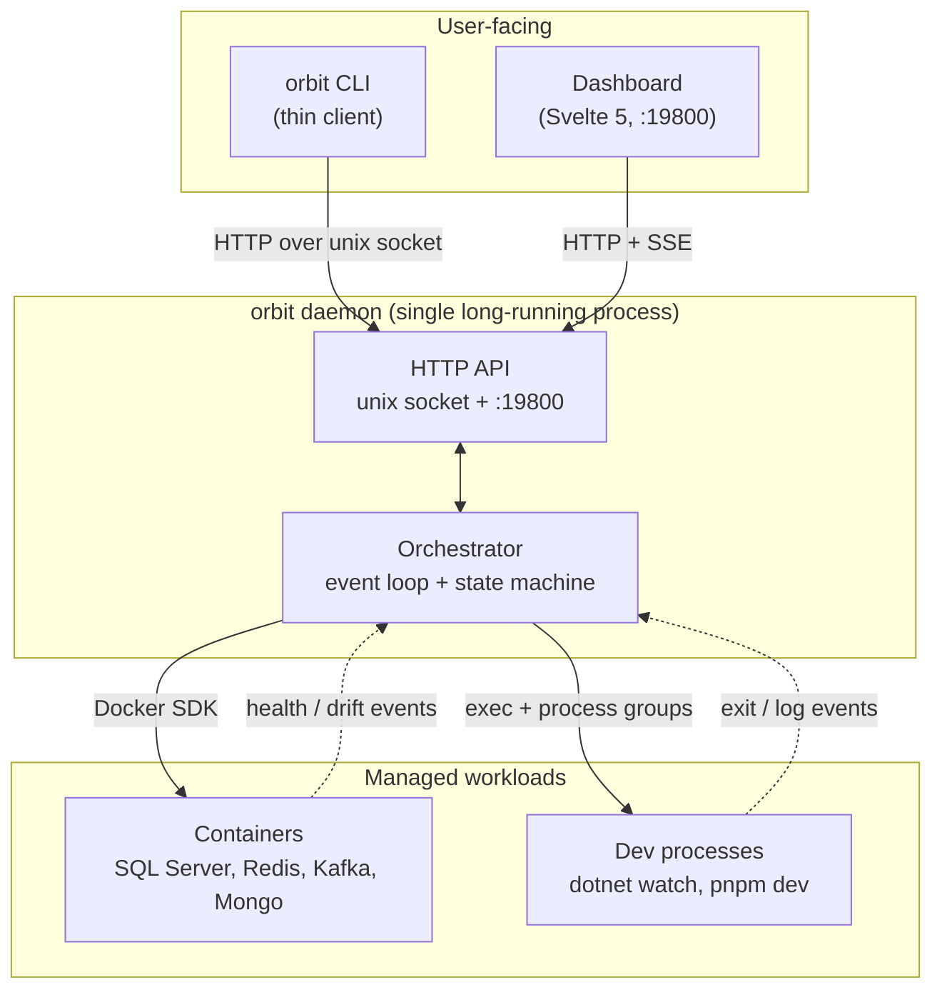
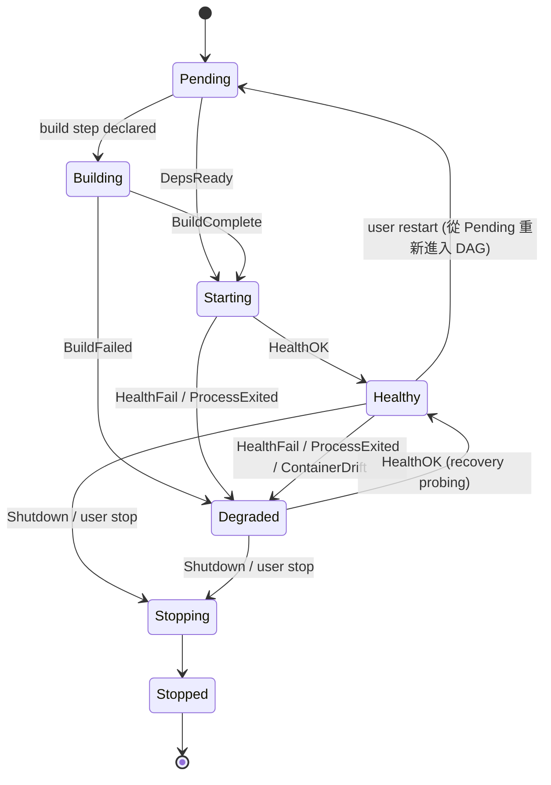
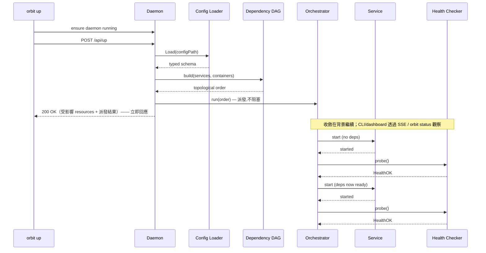

# Architecture

[English](./architecture.md) · [繁體中文](./architecture.zh-TW.md)

這份文件說明 Orbit 內部的組件如何串接，讓你不用重讀整個 codebase 也能擴充、除錯或 audit。

## Overview



三個要先記在腦袋裡的概念:

1. **daemon 是大腦。** 所有 state 都由它持有。CLI 是 stateless 的 —— 打開 socket、送一次 request、印出結果、結束。dashboard 走的是同一套 API，只是改用 TCP 加上 SSE stream。
2. **orchestrator 是 event-driven。** 單一 goroutine 從 buffered channel 消費事件(`HealthOK`、`ProcessExited`、`ContainerDrift`、…)，同步套用 state transition。container 與 dev process 共用同一套 state machine，只有 supervision 機制不同。
3. **相依關係是 DAG，不是序列。** Service 只要 `depends_on` 的目標進入 `Healthy` 就會啟動;互不相依的分支會並行跑。

剩下的章節會逐一切進每個元件。

## Component map

```
orbit up
  │
  ├─ Config Loader      config/                YAML → typed schema, env-var substitution, validation
  ├─ Dependency DAG     internal/engine/       Topological sort over services + containers
  ├─ Orchestrator       internal/engine/       Event loop: translates events into state transitions
  ├─ Scheduler          internal/engine/       Decides what to start / stop / restart next
  ├─ Container Manager  container/             Docker SDK wrapper (inspect, start, stop, poll, seed, init)
  ├─ Process Manager    process/               Spawn / kill dev processes with group isolation
  ├─ Health Checker     internal/health/       http, tcp, log, exec, healthcheck probes + wait strategies
  ├─ Port / Preflight   port/, internal/preflight/  Reserve ports, check prerequisites before launch
  ├─ Env Sync           internal/envsync/      Shallow-clone / refresh env configs from git
  └─ Daemon Server      internal/daemon/       Unix socket + TCP :19800 API, Svelte 5 dashboard, SSE
```

CLI(`app` package，由各 binary 的薄 `cmd/orbit/main.go` 接線)是 daemon 的薄客戶端 —— 每個 subcommand 要嘛透過 unix socket 跟 daemon 對話，要嘛在本機跑 subprocess(docker、dotnet)。

## Service state machine

每個 service 與 container 都會走過同一組狀態。Transition 由 orchestrator event 驅動。



State 常數定義在 `internal/engine/state.go`，以 `ServiceState`(iota enum:`StatePending`、`StateBuilding`、`StateStarting`、`StateHealthy`、`StateDegraded`、`StateStopping`、`StateStopped`、`StateRestarting`)呈現。請使用這些常數 —— 純字串只會出現在 JSON 輸出。（`StateRestarting` 仍為 wire／String 相容而保留，但目前的 lifecycle 會讓 restart 直接回到 `Pending`，而不是停留在它 —— 見上方 state 圖。）

## Event loop

Orchestrator 跑一條 goroutine，從 buffered channel 消費事件。事件定義在 `internal/engine/state.go`:

| Event | 觸發時機 | 典型反應 |
|---|---|---|
| `DepsReady` | 所有宣告的 `depends_on` 目標都到達 `Healthy` | 啟動本 service |
| `HealthOK` | 上一次非 OK 之後，probe 成功 | 標記 `Healthy`;通知 dependent |
| `HealthFail` | Probe 失敗或 timeout | 標記 `Degraded`;可能觸發 restart |
| `ProcessExited` | 子 dev process 退出 | 標記 `Degraded`(非預期)或 `Stopped`(預期) |
| `ContainerDrift` | Docker poll 發現 container 實際狀態與 Orbit 認知不同 | 對齊:標記 `Degraded` 或 re-sync |
| `BuildStarted` / `BuildComplete` / `BuildFailed` | Service build 步驟(例如 `dotnet build`)生命週期 | 走過 `Building` → `Starting` |
| `Shutdown` | `orbit down` 或 signal | 沿 DAG 反向順序串聯把 service 帶到 `Stopping` |

（`EventServiceLog` 載著一行擷取到的 stdout/stderr。它走同一個 loop 派發，但不觸發任何狀態轉換 —— 它會廣播給 log 訂閱者（SSE、`orbit logs`），所以上面的轉換表沒有列它。）

事件本身不會直接改 state —— 它們會被 dispatch 給 orchestrator，由 orchestrator 同步套用 transition。這樣 state machine 維持單執行緒，race condition 也比較好推理。

## Startup sequence



`POST /api/up` 在啟動被*派發*出去時就回應（`handlers_service.go` 呼叫 `StartServices` 後立即回），不是等全部 healthy 才回 —— CLI/dashboard 透過 SSE status 串流觀察收斂。Service 只要宣告的相依到達 `Healthy` 就會被拉起。DAG 本身不會阻塞 —— 互不相依的 service 是並行啟動的；唯一例外是未啟用 watch 的 .NET service build，它們共用一個可感知 context 的 admission gate。每個依序完成建置的 service，其 runtime process 仍會各自立即啟動。

回應會列出 daemon 解析後的精確 resource 集合，包含遞迴相依與 group
篩選結果；CLI 只等待這個集合。集合為空時，`up` 是明確且成功的 no-op，
會立即返回，不會進入 health timeout。

## Container supervision vs process supervision

| | Container | Process |
|---|---|---|
| 擁有者 | `container/manager.go` | `process/manager.go` |
| 啟動 | Docker `container.create` + `container.start` | `exec.Command` 放在獨立的 process group(Unix 上用 `setpgid`，Windows 上用 Job Objects) |
| 停止 | Docker stop + 10 秒緩衝 → kill | 對 group 送 SIGTERM → `shutdown_timeout` 緩衝（預設 30 秒）→ 對 group 送 SIGKILL |
| Health | 每 2 秒透過 `container.inspect` polling，再加上 service 宣告的 `health_check` | 只跑宣告的 `health_check` |
| Drift 偵測 | Docker snapshot 成功後，對齊停止、移除或被外部重啟的 container | 隱式:process 死掉就會觸發 `ProcessExited` |

兩者共用同一套 state machine 與 event loop，差異完全收斂在各自 package 的 `manager.go` 內。

Docker API 連續失敗兩次後，Orbit 才會撤回先前的 healthy 判斷，避免一次短暫的
transport 抖動造成使用者可見的狀態跳動。`status` 會指出 Docker 才是根因並導向
`orbit doctor`。Orbit 會持續輪詢，Docker 恢復後自動修正 resource 狀態；使用者
不需要重啟 Orbit，也不需要逐一重啟 container。

## Cross-platform process groups

用 SIGTERM 殺 dev process(例如 `dotnet watch`)時，孫程序常常會殘留。Orbit 的解法是把每個 spawn 出來的 process 放進自己的 process group，然後對**整個 group** 送 signal，而不是只對 leader。

- **Unix**(Linux/macOS 上的 `platform/process_unix.go`):`syscall.SysProcAttr{Setpgid: true}`，shutdown 時呼叫 `syscall.Kill(-pgid, sig)`。
- **Windows**:Job Objects。Spawn 出來的 process 會被附掛到一個 job，關閉 job handle 會把所有後代 atomic 地一起終止。

結果是:`orbit down` 能可靠地回收整棵 process tree —— 不管是 shell、reload 中的 `dotnet watch` server,還是 `pnpm dev` 的 Vite instance —— 而不是只對 leader 送 signal、留下孫程序。

## Health check types

`internal/health/checker.go` 實作了五種 probe:

| Type | 用途 | 節奏 |
|---|---|---|
| `http` | HTTP endpoint 回傳 2xx | 每 `health_check_interval` poll 一次 |
| `tcp` | TCP port 接受連線 | Polled |
| `exec` | 在 container 裡跑一個 command;exit 0 視為 healthy | Polled |
| `log` | 對 container log 做 regex 比對 | 由 log tail 觸發 |
| `healthcheck` | 直接用 Docker 自己的 `HEALTHCHECK` 結果 | 透過 inspect polling |

Probe 在 per-service 的 goroutine 跑，context 會在 stop 時被 cancel —— 參考 `internal/health/checker.go` 與 `internal/health/` 底下的測試(例如 `checker_test.go`、`recover_test.go`)看完整契約。

啟動完成後，可重複的 probe（`http`、`tcp`、`exec` 與 Docker
`healthcheck`）都會持續執行。可設定的連續失敗門檻避免單次暫時性失敗讓
graph 反覆變色；一次成功即可讓 degraded 資源恢復。`log` 仍是一次性的
readiness 訊號，因為過去曾出現的 log 無法做有意義的反向探測。

Status 組裝會疊加依賴可用性，但不改寫 lifecycle state。若仍在執行的 healthy
process 依賴 stopped 或 degraded 資源，API view 會以 degraded 和
`blocked_by` 呈現，並保留可追查的直接依賴鏈。根因依賴恢復後，這層狀態會
自動消失，仍在執行的下游不需 restart 就能恢復。

## Daemon server

`internal/daemon/server.go` 就是那個單一長駐 process，它對外暴露:

- **Unix socket**（`~/.orbit/orbit.sock`）—— CLI ↔ daemon 的 HTTP（REST `/api/...`），走 unix socket
- **Loopback TCP :19800** —— 同一套 HTTP API，加上 Svelte 5 dashboard（透過
  `go:embed` 內嵌）與 SSE stream。Browser-facing control surface 會驗證
  loopback Host，且 mutation 必須是 same-origin。

Unnamed runtime 會維持這些舊有 paths 與 names。Named runtime 的 ownership、
state layout、port persistence 與 cleanup semantics 定義於
[隔離的 runtime instances](instances.zh-TW.md)。

所有 HTTP handler 依關注點分散在 `internal/daemon/*.go`:

| File | 負責 |
|---|---|
| `server.go` | Router、middleware |
| `handlers_service.go` | up/down/stop/restart/logs |
| `handlers_service_env.go` | 個別 service 的 env var override |
| `handlers_mode.go` | 個別 service 的 dev ↔ container mode 切換 |
| `handlers_logging.go` | SSE log tail |
| `handlers_env_toggles.go` | 各 env 的 feature toggle |
| `handlers_events.go` | SSE status event stream |
| `handlers_traces.go` | Trace 列表 / 詳情([tracing.zh-TW.md](tracing.zh-TW.md)) |
| `handlers_graph.go` | 相依 DAG 查詢 |
| `handlers_history.go` | 過去執行紀錄 |
| `handlers_settings.go` | User settings(workspace root) |
| `resource_snapshot.go` | `GET /api/resources` — 統一、唯讀的 resource snapshot |
| `envs.go` / `envs_dir.go` | Env 列表 / 當前 env |
| `doctor.go` | Health 診斷 |

Daemon 持有所有共享 state。CLI 指令是 stateless 的 —— 開 socket、送一次 request、印出、結束。

### Resource snapshot 契約

`GET /api/resources` 用同一個 display-oriented shape
`{schema_version, env, resources}` 呈現 containers、services、externals、
databases、tunnels 與 claimed routes。每個 resource 都有 `name`、開放集合的
`type` 與 `state`、選配的 `parent` 與 `depends_on`，以及扁平的字串
`properties`。

這份契約只做 additive change；只有移除或改名才增加 `schema_version`。
Consumer 必須能通用呈現未知的 resource type、state、field 與 property。
`parent` 表示 ownership，`depends_on` 表示啟動圖；排序固定，parent 在 child
之前。

Snapshot 不取代 domain-specific API。Streams、graph presentation、actions
與跨機器 tunnel claims 仍由各自 endpoint 負責。

## Extension points

常見改動與對應位置。Optional feature 透過 `extension` package 接上 commands、
daemon routes 與 dashboard panels；以下各點適用於 core 本身的變更。

### 新增一種 service `type`
1. 在 `config/schema.go` 擴充 `Service.Type` discriminator。
2. 在 `internal/engine/scheduler.go` 加上能拉起這個 type 的 launcher。
3. 如果 health check 邏輯不同，在 `internal/health/checker.go` 加一個 probe type。
4. 在 `envs/example.yaml` 補上參考設定。

### 新增一種 health check type
1. 在 `internal/health/checker.go`(`checker.probe()`)裡加一個 case。
2. 在 `docs/configuration.md` 文件化對應的 YAML 形狀。

### 新增一種 init hook
目前的 type:`kafka_topics`、`mongo_rs`。要新增一種:
1. 在 `container/init.go` 加一個 case。
2. 在 `config/schema.go` container 的 `init` block 底下定義對應 config struct。

### 新增一個 CLI subcommand
1. 在 `app/` 底下新增檔案，由 `fooCmd()` factory 回傳 `*cobra.Command`。
2. 在 `app/root.go` 的 `Main()` 註冊。
3. 如果它要跟 daemon 對話，在 `internal/daemon/*.go` 加對應 handler，再從 command 呼叫:payload 是 wire 型別就加 `daemon.Client` method(公開 `daemon` package);payload 用到 core-internal 型別，就在 command 旁邊用 `Client.GetDecode`/`PostJSON` 寫 unexported helper(見 `app/traces.go`、`app/history.go`)。

### 隨 binary 一起出貨新的 asset
用 `//go:embed` 內嵌，不要依賴 on-disk 路徑 —— 安裝好的 binary 旁邊不會有 source tree。Dashboard bundle 可參考 `cmd/orbit/dashboard.go`(在 binary 的 main package 內嵌後注入 daemon server;branded binary 也以相同方式內嵌自己的 dashboard build)。

## 延伸閱讀

- [docs/configuration.zh-TW.md](configuration.zh-TW.md) —— 完整 YAML schema 參考
- [docs/tracing.zh-TW.md](tracing.zh-TW.md) —— local OpenTelemetry workflow
