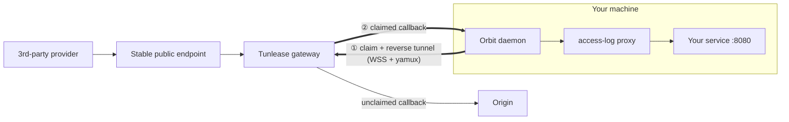

# Route staging callbacks to a local service

[English](./tunnel-claim.md) · [繁體中文](./tunnel-claim.zh-TW.md)

`orbit tunnel` uses the embedded [Tunlease](https://github.com/iml885203/tunlease) client to route stable third-party callback paths to a service on your machine. You do not need the `tul` binary, Kubernetes access, `kubectl`, or SSH.

## Quick start

Start your local service, open **Tunnel** in the dashboard, enter its local
port and callback path, then select **Claim route**. The page shows active
routes and incoming request logs.

The CLI equivalent is:

```bash
orbit tunnel claim /callbacks/provider-a/getbalance --to 8080
orbit tunnel list
```

Paths use Tunlease matching semantics directly: `/callback` is exact,
`/callback/*` matches one child level, and `/callback/**` matches the base path
and every descendant. The gateway rejects overlapping claims owned by another
session.

The claim command shares Tunlease's complete flag contract:
`-p/--to`, `-g/--gateway`, `-t/--token`, `-k/--insecure`, `-d/--detach`, and
`-o/--output`. Gateway flags override the active Orbit environment for that
claim.

Like `tul claim`, the command stays in the foreground by default, streams
request activity, and releases its paths on Ctrl+C. Add `--detach` to return
after the claim and data tunnel are ready; the Orbit daemon keeps that session
alive until `orbit tunnel release` or daemon shutdown.

To inspect all active gateway claims:

```bash
orbit tunnel list --all
orbit tunnel list --output json
```

Release one path or every path targeting a local port:

```bash
orbit tunnel release /callbacks/provider-a/getbalance
orbit tunnel release --to 8080
```

Orbit reconnects the data tunnel automatically. It releases active claims when the daemon shuts down; a lost WebSocket also releases the gateway claim. Tunnel requests remain visible in the Orbit Dashboard.

## How it works



Orbit dials out to the gateway; nothing connects directly into your machine.
The WSS connection owns the claimed path. Matching callbacks travel back through
the same tunnel, pass through Orbit's access-log proxy, and reach your service.
Unclaimed callbacks continue to Origin.

## Configuration

The shared configuration is `envs/data/claim.yaml`:

```yaml
gateway: http://tunlease.example.com
```
