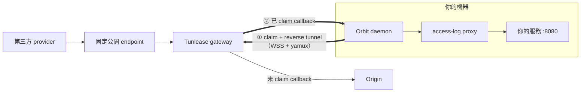

# 將 staging callback 導向本機服務

[English](./tunnel-claim.md) · [繁體中文](./tunnel-claim.zh-TW.md)

`orbit tunnel` 內嵌 [Tunlease](https://github.com/iml885203/tunlease) client，能把第三方固定呼叫的 callback path 導向你電腦上的服務。不需要另外安裝 `tul` binary，也不需要 Kubernetes 權限、`kubectl` 或 SSH。

## 快速開始

先啟動本機服務，在 dashboard 開啟 **Tunnel**，輸入 local port 與 callback
path，再按 **Claim route**。畫面會顯示 active routes 與收到的 request logs。

對應的 CLI 指令是：

```bash
orbit tunnel claim /callbacks/provider-a/getbalance --to 8080
orbit tunnel list
```

Path 會直接使用 Tunlease matching 語意：`/callback` 是 exact match、
`/callback/*` 符合一層 child path，`/callback/**` 則符合 base path 與所有
descendant。若 path 已被其他 session 佔用，gateway 會拒絕重疊 claim。

Claim command 共用 Tunlease 的完整 flag contract：`-p/--to`、
`-g/--gateway`、`-t/--token`、`-k/--insecure`、`-d/--detach` 與
`-o/--output`。Gateway flags 會覆蓋該次 claim 使用的 active Orbit
environment 設定。

與 `tul claim` 相同，指令預設會留在 foreground、stream request activity，
並在 Ctrl+C 時 release paths。加入 `--detach` 才會在 claim 與 data tunnel
ready 後返回；Orbit daemon 會持有該 session，直到執行
`orbit tunnel release` 或 daemon shutdown。

```bash
# 查看 gateway 上所有人的 claim
orbit tunnel list --all
orbit tunnel list --output json

# 釋放單一路徑或某個本機 port 的所有路徑
orbit tunnel release /callbacks/provider-a/getbalance
orbit tunnel release --to 8080
```

Orbit 會自動重新連線；daemon 關閉時會 release claim，WebSocket 中斷也會讓 gateway 釋放 claim。Tunnel request 仍會顯示在 Orbit Dashboard。

## 運作方式



Orbit 會主動連向 gateway；沒有連線直接進入你的機器。WSS 連線會擁有
claimed path。符合的 callback 沿同一條 tunnel 送回，先通過 Orbit 的
access-log proxy，再到你的 service；未 claim 的 callback 繼續送到 Origin。

## 設定

共用設定位於 `envs/data/claim.yaml`：

```yaml
gateway: http://tunlease.example.com
```
